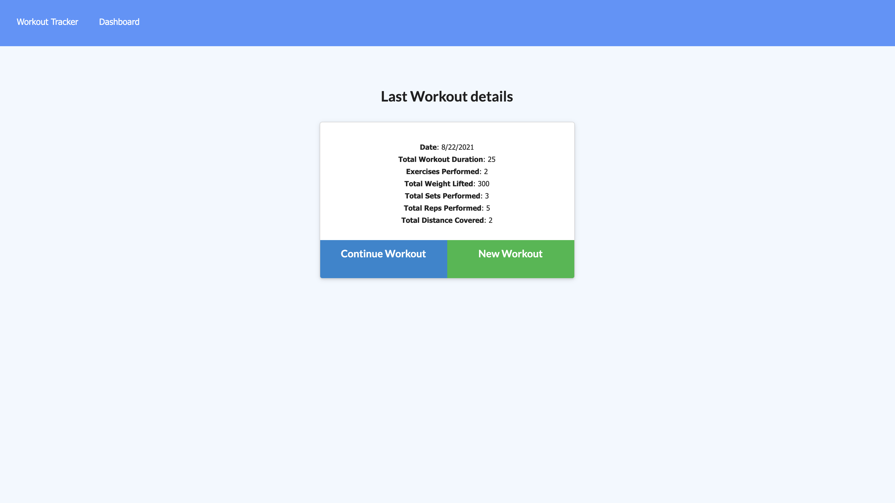

# Workout Tracker using 
Workout tracker is an application to view, create and track daily workouts.

Checkout my Heroku App [here](https://alap-workout-tracker.herokuapp.com/).
## Table of Contents
1. [Dependencies](#dependencies)
2. [Installation](#installation)
3. [Usage](#usage)
4. [Contributions](#contributions)
5. [Contact](#contact)
6. [License](#license)
7. [Screenshot](#screenshot)

## Getting Started
### Dependencies
node, npm, express, mongoose

### Installation
`npm install`

### Usage
`npm start`

## Contributions
Pull requests are welcome. For major changes, please open an issue first to discuss what you would like to change.

### Current contributors
None 

## Contact
Checkout my [GitHub](https://github.com/alapsraval).

For additional questions, feel free to reach out to me at alapsraval@gmail.com.

## License
Copyright &copy; Alap Raval. All rights reserved.

Licensed under the [MIT](https://opensource.org/licenses/MIT) license.

## Screenshot

